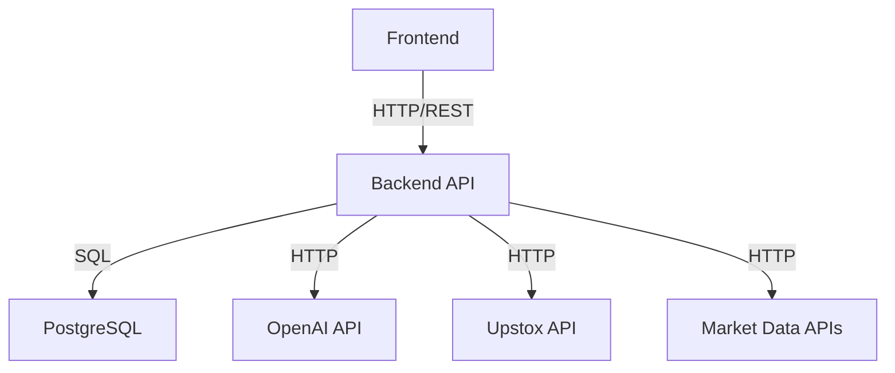

# Portfolio Coach - System Architecture

## Overview

Portfolio Coach is a microservices-based portfolio management system designed for scalability, reliability, and performance. The system follows modern architectural patterns and best practices for enterprise applications.

## High-Level Architecture

```
┌─────────────────────────────────────────────────────────────────┐
│                        Client Layer                             │
├─────────────────────────────────────────────────────────────────┤
│  Web Browser (React SPA)  │  Mobile App  │  API Clients        │
└─────────────────────────────────────────────────────────────────┘
                                │
                                ▼
┌─────────────────────────────────────────────────────────────────┐
│                      Load Balancer / Nginx                     │
│                    (Reverse Proxy & SSL)                       │
└─────────────────────────────────────────────────────────────────┘
                                │
                                ▼
┌─────────────────────────────────────────────────────────────────┐
│                    Application Layer                            │
├─────────────────────────────────────────────────────────────────┤
│  Frontend Service  │  Backend API  │  AI Chat Service          │
│  (React + Nginx)   │  (Flask)      │  (OpenAI Integration)     │
└─────────────────────────────────────────────────────────────────┘
                                │
                                ▼
┌─────────────────────────────────────────────────────────────────┐
│                     Service Layer                               │
├─────────────────────────────────────────────────────────────────┤
│ Portfolio Service │ Market Service │ Risk Service │ Chat Service│
└─────────────────────────────────────────────────────────────────┘
                                │
                                ▼
┌─────────────────────────────────────────────────────────────────┐
│                      Data Layer                                 │
├─────────────────────────────────────────────────────────────────┤
│  PostgreSQL DB    │  Redis Cache   │  File Storage (S3)        │
└─────────────────────────────────────────────────────────────────┘
```

## Component Details

### 1. Frontend Service (React + Nginx)

**Technology Stack:**
- React 18.0+
- Tailwind CSS
- React Router
- Recharts (Data Visualization)
- React Markdown

**Responsibilities:**
- User interface rendering
- Client-side routing
- State management
- API communication
- Real-time updates

**Port:** 9855

### 2. Backend API Service (Flask)

**Technology Stack:**
- Python 3.11+
- Flask Framework
- SQLAlchemy ORM
- Flask-CORS
- JWT Authentication

**Responsibilities:**
- REST API endpoints
- Business logic processing
- Data validation
- Authentication & authorization
- Service orchestration

**Port:** 9854

### 3. AI Chat Service

**Technology Stack:**
- OpenAI GPT-4/3.5
- RAG (Retrieval-Augmented Generation)
- MCP (Model Context Protocol)
- Custom prompt engineering

**Responsibilities:**
- Natural language processing
- Portfolio analysis
- Investment recommendations
- Risk assessment
- Educational content generation

### 4. Database Service (PostgreSQL)

**Technology Stack:**
- PostgreSQL 13+
- Connection pooling
- Automated backups
- Data encryption

**Responsibilities:**
- Portfolio data storage
- User management
- Transaction history
- Performance metrics
- Audit logs

**Port:** 9853

## Service Communication

### Internal Communication



### API Design Patterns

1. **RESTful Design**
   - Resource-based URLs
   - HTTP method semantics
   - Stateless operations
   - Consistent error handling

2. **Microservices Communication**
   - HTTP/REST for synchronous calls
   - Message queues for asynchronous processing
   - Service discovery and health checks

3. **Data Flow**
   - Request validation
   - Business logic processing
   - Data persistence
   - Response formatting

## Security Architecture

### Authentication & Authorization

```
┌─────────────────┐    ┌─────────────────┐    ┌─────────────────┐
│   User Login    │───►│  JWT Token      │───►│  API Access     │
│   (Credentials) │    │  Generation     │    │  (Authorization)│
└─────────────────┘    └─────────────────┘    └─────────────────┘
```

### Data Protection

- **Encryption at Rest**: AES-256 for sensitive data
- **Encryption in Transit**: TLS 1.3 for all communications
- **Input Validation**: Comprehensive sanitization
- **Rate Limiting**: API protection against abuse

## Scalability Design

### Horizontal Scaling

```yaml
services:
  portfolio_web:
    image: portfolio-backend
    scale: 3
    load_balancer:
      algorithm: round_robin
      health_check: /api/health
```

### Database Scaling

- **Read Replicas**: For read-heavy operations
- **Connection Pooling**: Efficient resource utilization
- **Caching Layer**: Redis for frequently accessed data
- **Sharding**: For large datasets (future)

### Performance Optimization

1. **Frontend Optimization**
   - Code splitting and lazy loading
   - CDN for static assets
   - Service worker for caching
   - Progressive Web App features

2. **Backend Optimization**
   - Database query optimization
   - Caching strategies
   - Async processing
   - Connection pooling

3. **Infrastructure Optimization**
   - Auto-scaling based on load
   - Load balancing
   - CDN integration
   - Monitoring and alerting

## Deployment Architecture

### Container Orchestration

```yaml
version: '3.8'
services:
  frontend:
    image: portfolio-frontend
    ports:
      - "9855:80"
    depends_on:
      - backend
  
  backend:
    image: portfolio-backend
    ports:
      - "9854:5000"
    environment:
      - DATABASE_URL=postgresql://user:pass@db:5432/portfolio
    depends_on:
      - database
  
  database:
    image: postgres:13
    ports:
      - "9853:5432"
    volumes:
      - postgres_data:/var/lib/postgresql/data
```

### Environment Management

- **Development**: Local Docker Compose
- **Staging**: Cloud-based staging environment
- **Production**: Multi-region deployment
- **CI/CD**: Automated deployment pipeline

## Monitoring & Observability

### Health Checks

```python
@app.route('/api/health')
def health_check():
    return {
        'status': 'healthy',
        'timestamp': datetime.utcnow(),
        'version': '1.0.0',
        'services': {
            'database': check_database_health(),
            'ai_service': check_ai_service_health(),
            'market_data': check_market_data_health()
        }
    }
```

### Logging Strategy

- **Structured Logging**: JSON format for easy parsing
- **Log Levels**: DEBUG, INFO, WARNING, ERROR, CRITICAL
- **Centralized Logging**: ELK stack integration
- **Audit Logging**: Security and compliance

### Metrics Collection

- **Application Metrics**: Response times, error rates
- **Business Metrics**: Portfolio performance, user engagement
- **Infrastructure Metrics**: CPU, memory, disk usage
- **Custom Metrics**: AI response quality, recommendation accuracy

## Disaster Recovery

### Backup Strategy

- **Database Backups**: Daily automated backups
- **Configuration Backups**: Version-controlled configs
- **Code Backups**: Git repository with multiple remotes
- **Data Retention**: Configurable retention policies

### Recovery Procedures

1. **Database Recovery**
   - Point-in-time recovery
   - Cross-region replication
   - Automated failover

2. **Service Recovery**
   - Health check monitoring
   - Automatic restart policies
   - Circuit breaker patterns

3. **Data Recovery**
   - Backup restoration procedures
   - Data validation processes
   - Rollback mechanisms

## Future Architecture Considerations

### Planned Enhancements

1. **Event-Driven Architecture**
   - Message queues for async processing
   - Event sourcing for audit trails
   - CQRS for read/write separation

2. **Microservices Evolution**
   - Service mesh implementation
   - API gateway for external access
   - Service discovery and registration

3. **AI/ML Pipeline**
   - Model training infrastructure
   - A/B testing framework
   - Feature store for ML features

4. **Multi-Tenancy**
   - Tenant isolation
   - Resource quotas
   - Customization capabilities

## Technology Decisions

### Why These Technologies?

1. **React**: Component-based architecture, large ecosystem
2. **Flask**: Lightweight, flexible, Python ecosystem
3. **PostgreSQL**: ACID compliance, JSON support, reliability
4. **Docker**: Containerization, consistency, scalability
5. **OpenAI**: State-of-the-art AI capabilities

### Alternatives Considered

- **Frontend**: Vue.js, Angular (React chosen for ecosystem)
- **Backend**: FastAPI, Django (Flask chosen for simplicity)
- **Database**: MongoDB, Redis (PostgreSQL chosen for ACID)
- **AI**: Azure OpenAI, Google AI (OpenAI chosen for quality)

## Performance Benchmarks

### Current Performance

- **API Response Time**: < 200ms (95th percentile)
- **Database Query Time**: < 50ms (average)
- **AI Response Time**: < 2s (average)
- **Frontend Load Time**: < 1s (first contentful paint)

### Optimization Targets

- **API Response Time**: < 100ms (95th percentile)
- **Database Query Time**: < 25ms (average)
- **AI Response Time**: < 1s (average)
- **Frontend Load Time**: < 500ms (first contentful paint)

## Conclusion

The Portfolio Coach architecture is designed for:

- **Scalability**: Horizontal scaling capabilities
- **Reliability**: High availability and fault tolerance
- **Security**: Comprehensive security measures
- **Performance**: Optimized for speed and efficiency
- **Maintainability**: Clean code and documentation
- **Extensibility**: Easy to add new features

This architecture provides a solid foundation for current needs while allowing for future growth and evolution. 